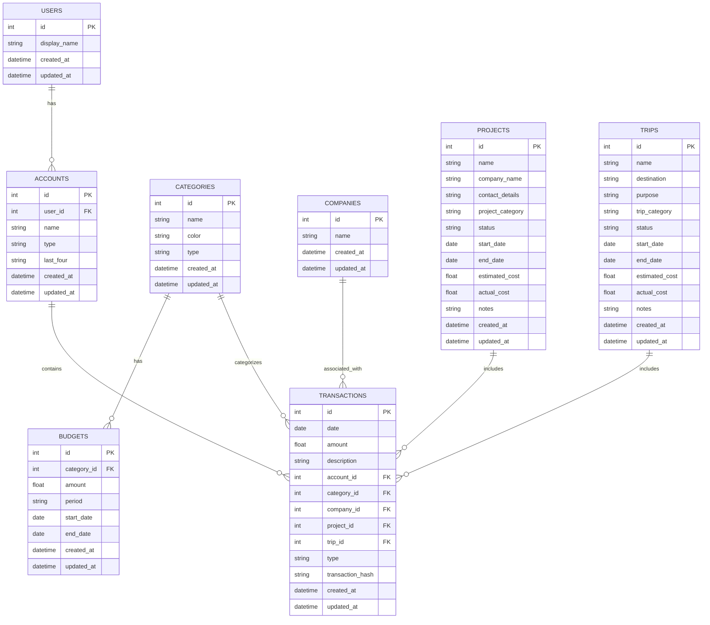

# Updated Database ER Diagram

Based on the updated database schema with Users, Accounts, and Trips functionality:

## Key Features Added:

1. **Users Table**: Central user management with display names
2. **Enhanced Accounts**: Now linked to users with last 4 digits and account types
3. **Trips Table**: Full trip management with categories, status, dates, and costs
4. **Transaction Labeling**: Transactions can now be associated with both projects and trips
5. **Normalized Structure**: Eliminated redundant AccountAlias table

## Relationships:

- **One-to-Many**: Users → Accounts → Transactions
- **Optional References**: Transactions can reference Projects, Trips, Categories, and Companies
- **Flexible Labeling**: Transactions can be labeled with either a Project OR a Trip (or neither)