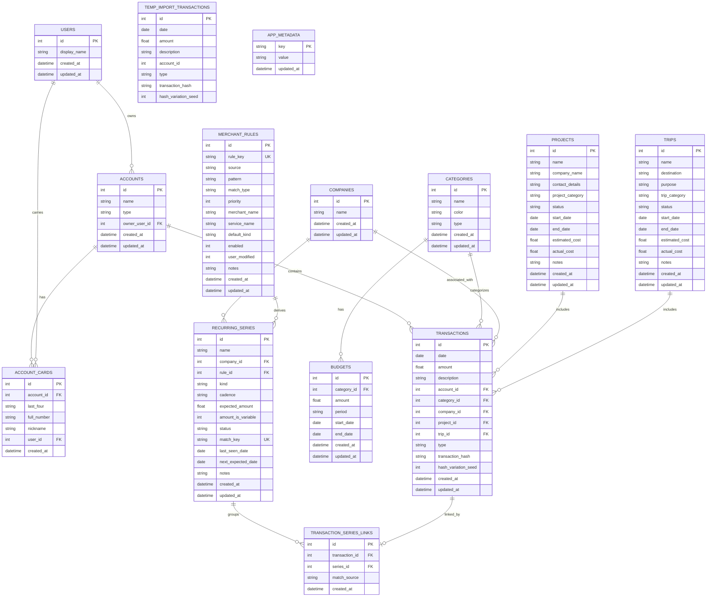

# Updated Database ER Diagram

Based on the current database schema (source of truth: `public/database-schema.js`), including users, accounts, account cards, trips, merchant rules, and recurring-subscription tracking:

## Key Features:

1. **Users Table**: Central user management with display names
2. **Accounts + Account Cards**: Accounts are owned via `owner_user_id`; card last-four digits live on `account_cards` and drive CSV import account matching. `account_cards.last_four` is unique per account (not globally), so different accounts may share a last-four; an optional `full_number` disambiguates them (used only for matching — never displayed, since the UI always shows just the last four digits) via `idx_account_cards_full_number`
3. **Trips Table**: Full trip management with categories, status, dates, and costs
4. **Transaction Labeling**: Transactions can be associated with both projects and trips
5. **CSV Import Staging**: `temp_import_transactions` stages imports for duplicate analysis before `transactions` receives them
6. **Merchant Rules**: Community-seeded + user-defined description patterns that map raw bank charge descriptions to merchants (`companies`), optional services, and a default kind (subscription / bill / purchase). Community reseeds respect `user_modified`
7. **Recurring Series**: Detected subscriptions and recurring bills with cadence, expected amount, status lifecycle (candidate → active / inactive / ignored), and idempotent rescans via unique `match_key`
8. **Transaction–Series Links**: Join table connecting transactions to their recurring series (avoids altering the transactions table)
9. **App Metadata**: Key/value store for versioned assets such as the community merchant-rules seed version

## Relationships:

- **One-to-Many**: Users → Accounts → Transactions
- **Optional References**: Transactions can reference Projects, Trips, Categories, and Companies
- **Flexible Labeling**: Transactions can be labeled with either a Project OR a Trip (or neither)
- **Merchant Mapping**: `merchant_rules.merchant_name` is resolved to a `companies` row at match time (not a hard FK, so rules can seed before companies exist)
- **Subscriptions**: A transaction belongs to at most one recurring series (`transaction_series_links.transaction_id` is UNIQUE)

## Schema Versioning:

Schema changes are delivered by a `PRAGMA user_version`-gated migration runner in `public/database-worker.js` (`runMigrations()`), driven by the `MIGRATIONS` export in `public/database-schema.js`. Migration statements must be idempotent (`CREATE TABLE IF NOT EXISTS`) because fresh databases already receive all tables from `createTables()`.
